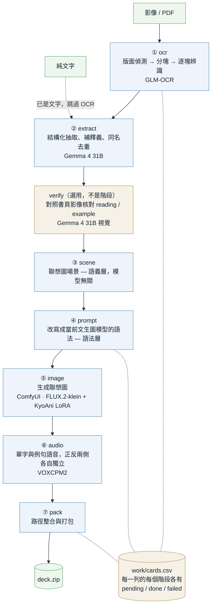

# anki-deck-builder

把書本影像、PDF 或純文字，變成「Anki 記憶引擎」可直接載入的牌組 ZIP——含結構化卡片欄位、
無文字的視覺記憶錨點圖，以及單字與例句的語音。複習與排程由記憶引擎負責，本專案只產出 ZIP，
**兩者唯一的交接介面就是這個檔案**。

全程在本機跑：OCR 與抽取走本地 Ollama、聯想圖走本地 ComfyUI、語音走本機的 VOXCPM2 套件。
沒有雲端、沒有帳號，也不需要網路（模型都在本機）。

## 處理流程



七個階段各自獨立、可分開跑。**中間的 `work/cards.csv` 就是狀態機**：每一列的每個階段
各記 `pending` / `done` / `failed`，所以長時間任務可中斷續作（重啟自動跳過已完成的列），
單張卡失敗也不會中斷整批，事後只重跑失敗的即可。

兩處拆分值得留意：

- **`scene`（語義層）與 `prompt`（語法層）是分開的。** 換文生圖模型時只要改
  `.env` 的 `IMAGE_PROMPT_AGENT` 再 `prompt --force`，人工編修過的場景一個字都不動。
- **`audio` 的正反兩側是兩個獨立階段**（`audio_front` / `audio_back`），任一側失敗
  不影響另一側。

`verify` **不是階段**——它的單位是「一塊影像 → 動好幾張卡」，沒有逐列狀態，
因此比照 `pack` 做成獨立子命令，也**不含在 `run-all` 裡**，需要時手動跑。

## 安裝

需要 [uv](https://docs.astral.sh/uv/)、Python 3.12、NVIDIA GPU（實測基準為 24 GB VRAM）。

```bash
git clone --recurse-submodules <repo-url> anki-deck-builder
cd anki-deck-builder
uv sync --all-extras
cp .env.example .env      # 再依你的環境修改，詳見 docs/usage.md
```

外部服務（Ollama 的模型、ComfyUI、VOXCPM2 權重）需另行準備，
步驟見 [docs/usage.md](docs/usage.md)〈前置需求〉。

## 最小範例

一頁單字書的照片 → 牌組 ZIP：

```bash
uv run anki-builder run-all --input ~/scans/n2_p333.jpg --output output/deck.zip
uv run anki-builder status                      # 看各階段的 pending / done / failed
uv run anki-builder serve                       # 需要人工檢視或重跑時，開 Web UI
```

**整本書一次做完**：`--input` 除了單張圖，也吃**整個資料夾**（依檔名自然排序，
`page2` 排在 `page10` 前面）、**PDF**（逐頁渲染）與 `.txt`／`.md`。不必先打包成 ZIP——
ZIP 只是輸出格式。

```bash
uv run anki-builder run-all --input ~/scans/n2_book/ --output output/deck.zip   # 整個資料夾
uv run anki-builder run-all --input ~/books/n2.pdf   --output output/deck.zip   # 整本 PDF
```

Web UI 也能直接匯入（輸入路徑，不必上傳）與重置工作檔，見
[docs/usage.md](docs/usage.md)〈Web UI〉。

`run-all` 會依序跑完七個階段。想一階一階來（或只重跑其中一段）：

```bash
uv run anki-builder ocr --input ~/scans/n2_p333.jpg
uv run anki-builder extract --deck-name 日語::N2 --card-language 繁體中文
uv run anki-builder verify --dry-run     # 選用：對照影像核對，先看稽核檔
uv run anki-builder scene
uv run anki-builder prompt
uv run anki-builder image
uv run anki-builder audio
uv run anki-builder pack --output output/deck.zip
```

## 文件

| 文件 | 內容 |
|------|------|
| [docs/usage.md](docs/usage.md) | **使用說明**：前置需求、`.env` 逐項說明、CLI 用法、Web UI 操作、疑難排解 |
| [docs/project-overview.md](docs/project-overview.md) | 目的、目標與非目標、技術棧、硬體預算 |
| [docs/architecture.md](docs/architecture.md) | 架構約束、模組結構、狀態機規格 |
| `docs/` 其餘檔案 | 編碼風格、測試策略、版控流程等開發規範 |

> 以 AI 協作開發本專案時，開工前的規範另見 `dev_ai` 分支上的 `CLAUDE.md`
> （該檔刻意不合併進 `main`）。
